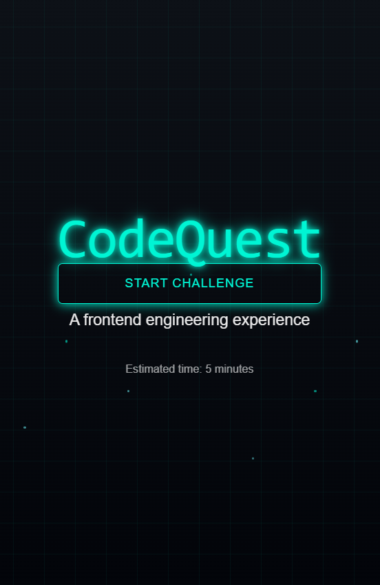
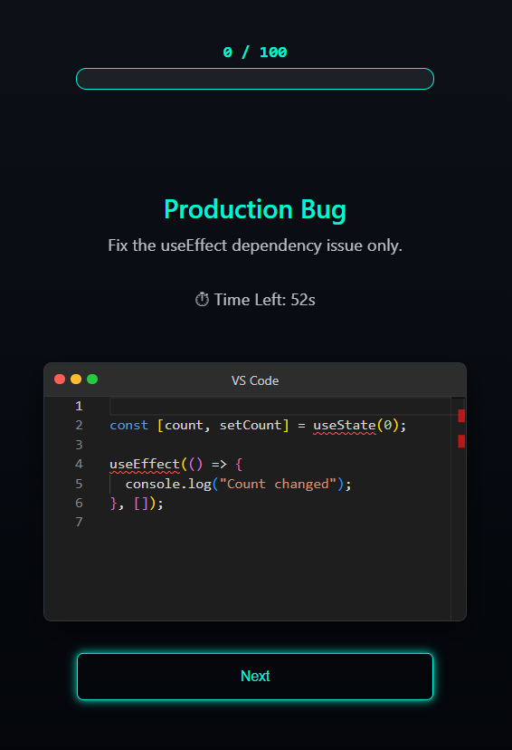
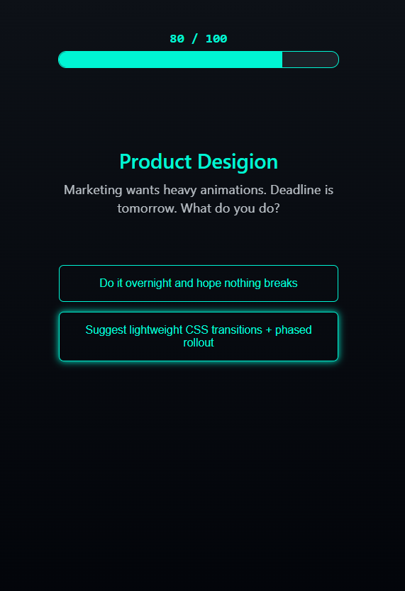
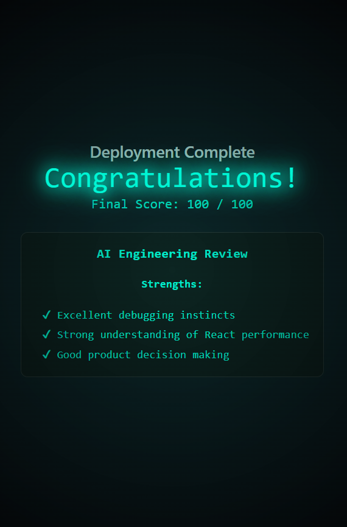
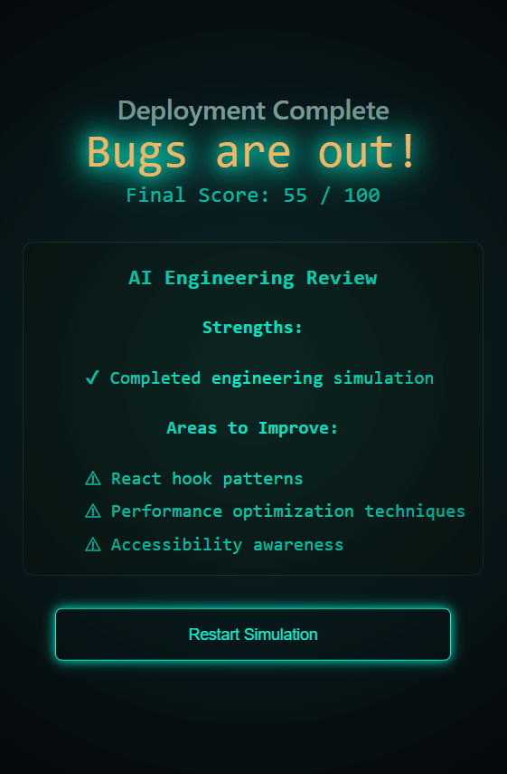

# CodeQuest — Frontend Engineering Simulation

**CodeQuest** is an interactive **React engineering simulation** where players progress through realistic frontend challenges including debugging, performance optimization, accessibility audits, and product trade-offs.

Instead of showcasing code through a static portfolio, CodeQuest simulates the **decision-making process of a real frontend engineer**.

# Live Demo
Try the simulation: https://codequestsimulation.web.app

# Simulation Overview

CodeQuest walks players through a series of **engineering scenarios inspired by real production issues.**

Players earn points based on the **quality of their solutions and engineering decisions**.

Simulation flow:

1. Landing Experience
2. Production Bug Debugging
3. Performance Optimization
4. Accessibility Audit
5. Product Decision
6. Final Deployment + AI Engineering Review

#  Screenshots

### Landing Experience

The simulation begins with a futuristic landing interface.

---

### Debugging Challenge

Players must fix a **React `useEffect` dependency bug** using a Monaco code editor.

---

### Engineering Decision Level

Players choose the best **performance optimization strategy**.

---

### Final Deployment

Example output for 100/100:

Example output for lower score:

The simulation ends with a final score and **AI engineering review**.

# Tech Stack

Core technologies used in this project:
- React
- TypeScript
- Monaco Editor
- React Context
- Custom Hooks
- CSS Modules

# Key Features

### Interactive Code Debugging

Players fix a real React bug inside a Monaco editor.

Example issue:

useEffect(() => {
  console.log("Count changed");
}, []);

Expected fix:

useEffect(() => {
  console.log("Count changed");
}, [count]);

### AI Engineering Review

At the end of the simulation, CodeQuest generates an **AI-style engineering review** summarizing their strengths and improvement areas.

### Score-Based Game System

Players earn points based on decision quality.

| Decision Quality          | Score |
| ------------------------- | ----- |
| Best engineering decision | 30    |
| Acceptable solution       | 15    |
| Poor solution             | 5     |

Final score determines the **deployment outcome**.

### Anti-Cheating Validation

CodeQuest includes anti-cheating protection for challenge submissions.

- Challenge attempts are written to Firestore (`challengeAttempts`).
- Firestore Security Rules validate allowed answers and reject invalid submissions.
- Challenge validation logic is enforced by backend rules, not trusted browser UI state.

This means users cannot simply edit local UI behavior to submit arbitrary answers.

### Timer on Engineering Challenge

The debugging level includes a **60-second countdown timer**.

useTimer(60, handleExpire)

If time expires, the simulation proceeds to the next scenario with 0 points.

#  Running Locally
Clone the repository and start the development server.
git clone https://github.com/Alina-Anton/codeQuest.git

# Project Structure

codequest
│
├── screenshots
│   ├── landing.png
│   ├── level1-bug.png
│   ├── level2-performance.png
│   ├── level3-accessibility.png
│   ├── level4-prod-decision.png
│   ├── final-deploy-high-score.png
│   └── final-deploy-lower-score.png
│
├── src
│   │
│   ├── levels
│   │   ├── Landing.tsx
│   │   ├── Level1Bug.tsx
│   │   ├── Level2Performance.tsx
│   │   ├── Level3Accessibility.tsx
│   │   ├── Level4Tradeoff.tsx
│   │   └── FinalDeploy.tsx
│   │
│   ├── components
│   │   ├── layout
│   │   │   └── Layout.tsx
│   │   │
│   │   └── ui
│   │       ├── Button.tsx
│   │       ├── ScoreBar.tsx
│   │       └── MonacoCodeEditor.tsx
│   │
│   ├── context
│   │   ├── GameContext.tsx
│   │   └── GameContext.test.tsx
│   │
│   ├── hooks
│   │   └── useTimer.ts
│   │
│   ├── test
│   │   └── setupTests.ts
│   │
│   ├── utils
│   │   └── generateAIReview.ts
│   │
│   ├── styles
│   │
│   ├── App.test.tsx
│   ├── App.tsx
│   └── main.tsx
│
├── public
│
├── jest.config.cjs
├── package.json
├── tsconfig.jest.json
├── tsconfig.json
└── README.md

#  Engineering Design Decisions

### Why Context API instead of Redux?

The application state is small and focused on:

* score
* current level
* game progression

Using **React Context** keeps the architecture simple without unnecessary dependencies.

### Why Monaco Editor?

Monaco provides a **real developer editing experience** similar to VS Code.

This makes the debugging challenge feel like an **authentic coding environment** rather than a quiz.

### Why a Simulation Instead of a Portfolio?

Most portfolios show UI work.

CodeQuest demonstrates:

* engineering reasoning
* debugging skills
* architecture thinking
* product trade-offs

Which better reflects **real frontend engineering work.**

#  Inspiration

CodeQuest was built to explore a new idea:

A developer portfolio should feel like a **product experience**, not just a collection of projects.

The goal is to demonstrate **engineering thinking through interaction**.

#  Future Improvements

Potential expansions include:

* more engineering challenge levels
* real code evaluation using AST parsing
* devtools-style console system
* multiplayer interview mode
* leaderboard and scoring system
* live component sandbox challenges

#  License

MIT License.
